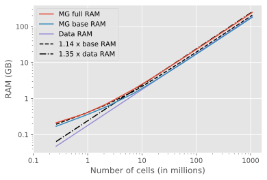

CPU & RAM
#########

Some notes regarding memory and runtime requirements; amongst others things
that have been tried, and things that could be tried.

Runtime
-------

The costliest functions (RAM- and CPU-wise) are already written in ``numba``.
There might be an additional gain by making :class:`emg3d.utils.TensorMesh`,
:class:`emg3d.utils.Model`, and :class:`emg3d.utils.Field` instances jitted
classes. Keep an eye on the progress of jitted classes within numba.

The costliest functions (for big models) are:

   - >90 %: :func:`emg3d.solver.smoothing` (:func:`emg3d.njitted.gauss_seidel`)
   - <5 % each, in decreasing importance:

      - :func:`emg3d.solver.prolongation`
        (:class:`emg3d.solver.RegularGridProlongator`)
      - :func:`emg3d.solver.residual` (:func:`emg3d.njitted.amat_x`)
      - :func:`emg3d.solver.restriction`

Example with 262,144 / 2,097,152 cells (``nu_{i,1,c,2}=0,2,1,2``;
``sslsolver=False``; ``semicoarsening=True``; ``linerelaxation=True``):

   - 93.7 / 95.8 % ``smoothing``
   - 3.6 / 2.0 % ``prolongation``
   - 1.9 / 1.9 % ``residual``
   - 0.6 / 0.4 % ``restriction``

The rest can be ignored. For small models, the percentage of ``smoothing`` goes
down and of ``prolongation`` and ``restriction`` go up. But then the modeller
is fast anyway.

**Therefore, any serious attempt to improve the speed would have to tackle the
smoothing itself.**

**Tried things**

- One important aspect of the smoothing part is the memory layout.
  :func:`emg3d.njitted.gauss_seidel` and :func:`emg3d.njitted.gauss_seidel_x`
  are ideal for F-arrays (loop z-y-x, hence slowest to fastest axis).
  :func:`emg3d.njitted.gauss_seidel_y` and
  :func:`emg3d.njitted.gauss_seidel_z`, however, would be optimal for C-arrays.
  But copying the arrays to C-order and afterwards back is costlier in most
  cases for both CPU and RAM. The one possible and therefore implemented
  solution was to swap the loop-order in :func:`emg3d.njitted.gauss_seidel_y`.
- Restriction/prolongation information could be saved in a dictionary instead
  of recalculating it every time. Turns out to be not worth the trouble.
- Rewrite :class:`emg3d.RegularGridInterpolator` as jitted function, but the
  iterator approach seems to be better for large grids.

**Not tried**

- Not much has been tested with the ``numba``-options ``parallel``; ``prange``;
  and ``nogil``.

Memory
------

Estimating the memory requirement is never an easy task. Here a few attempts.

Most of the memory requirement comes from storing the data itself, mainly the
fields (source field, electric field, and residual field) and the model
parameters (resistivity, eta, mu). For a big model, they some up; e.g.,
almost 3 GB for an isotropic model with 256x256x256 cells.

The `examples-gallery <https://github.com/empymod/emg3d-examples>`_ contains a
notebook to do some testing with regards to the RAM usage, see
`4a_RAM-requirements.ipynb
<https://github.com/empymod/emg3d-examples/blob/master/4a_RAM-requirements.ipynb>`_.
An example output of that notebook is shown in :numref:`Figure %s <ramusage>`.

   RAM usage: "Data RAM" is the memory required by the fields (source field,
   electric field, residual field) and by the model parameters (resistivity;
   and eta, mu). "MG Base" is for solving one Gauss-Seidel iteration on the
   original grid. "MG full RAM" is for solving one multigrid F-Cycle.

The theory of multigrid says that in an ideal scenario, multigrid requires
8/7 (a bit over 1.14) the memory requirement of carrying out one Gauss-Seidel
step on the finest grid. As can be seen in the figure, for models up to 2
million cells that holds pretty much, afterwards it becomes a bit worse.

However, for this estimation one has to run the model first. Another way to
estimate the requirement is by starting from the RAM used to store the fields
and parameters. As can be seen in the figure, for big models one is on the
save side estimating the required RAM as 1.5 times the storage required for
the fields and model parameters.

The figure also shows nicely the linear behaviour of multigrid; for twice the
number of cells twice the memory is required (from a certain size threshold
onwards, below that there is a non-linear overhead).

**Attempts at improving memory usage should focus on why the red line (actual
usage) and the dashed black line (1.14 x base usage) are diverging after two
million cells.**
