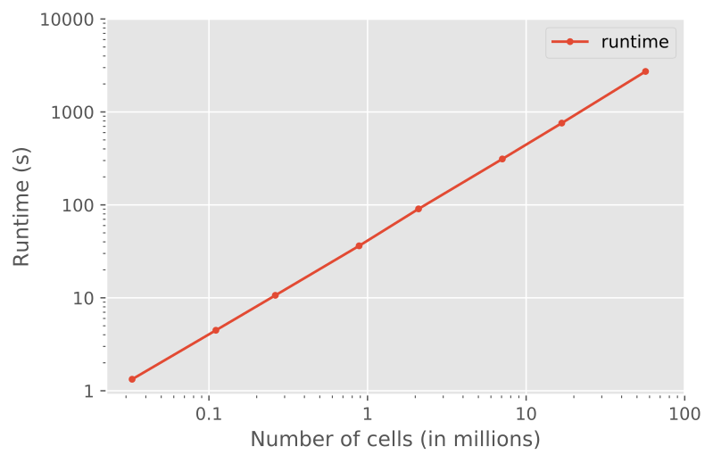
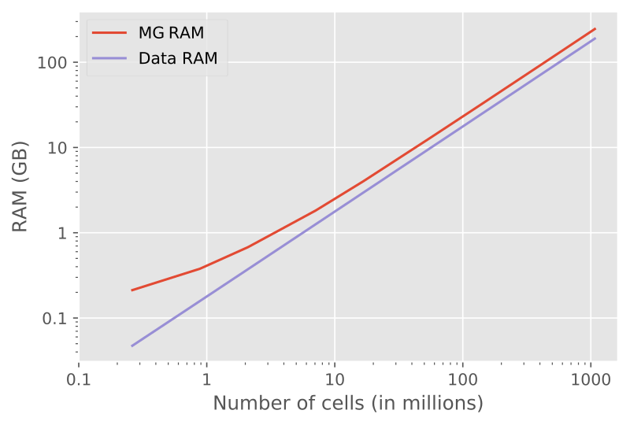

.. _info-tips-tricks:

Info, tips & tricks
===================


Coordinate System
-----------------

The used coordinate system is shown in :numref:`Figure %s <coordinate_system>`.
It is a right-handed system (RHS) with x pointing East, y pointing North, and z
pointing upwards. Azimuth :math:`\theta` is defined as the anticlockwise
rotation from Easting towards Northing, and elevation :math:`\varphi` is
defined as the anticlockwise rotation from the horizontal plane up.

.. figure:: ../_static/coordinate_system.svg
   :align: center
   :alt: Coordinate System
   :name: coordinate_system

   Coordinate system used in emg3d: RHS with positive z upwards.


Grid dimension
--------------

The multigrid method, as implemented, puts certain restrictions to the grid
dimension.

.. note::

    If you use emg3d through the :ref:`high-level-usage`
    (:class:`emg3d.simulations.Simulation`) with automatic gridding, or use
    :func:`emg3d.meshes.construct_mesh`, then the following is taken care of by
    emg3d itself. However, if you define the computational grids yourself, the
    following section is important.

You can provide any three-dimensional regular (stretched) grid into emg3d.
However, the implemented multigrid technique works with the existing nodes,
meaning there are no new nodes created as coarsening is done by combining
adjacent cells. The more times the grid dimension can be divided by two the
better it is therefore suited for MG. Ideally, the number should be dividable
by two a few times and the dimension of the coarsest grid should be 2 or a
small, odd number :math:`p`, for which good sizes can then be computed with
:math:`p\,2^n`. Good grid sizes (in each direction) up to 1024 are

- :math:`2·2^{3, 4, ..., 9}`: 16,  32,  64, 128, 256, 512, 1024,
- :math:`3·2^{3, 4, ..., 8}`: 24,  48,  96, 192, 384, 768,
- :math:`5·2^{3, 4, ..., 7}`: 40,  80, 160, 320, 640,

and preference decreases from top to bottom row. In sequential order: 16, 24,
32, 40, 48, 64, 80, 96, 128, 160, 192, 256, 320, 384, 512, 640, 768, 1024. You
can obtain the good cell number via :func:`emg3d.meshes.good_mg_cell_nr()`.


Solver or Preconditioner
-------------------------

The multigrid method can be used as a solver on its own or as a preconditioner
for a Krylov subspace solver such as BiCGSTAB. This can be controlled through
the parameter ``sslsolver`` in :func:`emg3d.solver.solve`. *SSL* stands here
for the module :mod:`scipy.sparse.linalg`, and other solvers provided by this
module can be used as well.

Using multigrid as a preconditioner for BiCGSTAB together with semicoarsening
and line relaxation is the **most stable combination**, for which it is the
default setting. However, it is also the **most expensive** setting, and often
you can obtain faster results by adjusting the combination of solver,
semicoarsening, and line relaxation. Which combination is best (fastest)
depends to a large extent on the grid stretching, but also on anisotropy and
general model complexity. See
:ref:`sphx_glr_gallery_tutorials_parameter_tests.py` in the gallery for an
example how to run some tests on your particular problem.


CPU & RAM
---------

The multigrid method is attractive because it shows optimal scaling for both
runtime and memory consumption. In the following are a few notes regarding
memory and runtime requirements. If you are interested in helping to improve
either have a look at :ref:`improve-cpu-ram`.


Runtime
```````

An example of a runtime test is shown in :numref:`Figure %s <runtime>`. The
example shows the runtime to solve for a source of 1.0 Hz at the origin of a
homogeneous space of 1.0 Ohm.m, where the grid starts at 32 x 32 x 32 (32,768)
to 384 x 384 x 384 (56,623,104). (You can find the script in
:ref:`improve-cpu-ram`.)




   Runtime as a function of cell size, which shows nicely the linear scaling
   of multigrid solvers (using a single thread).


The result shows the linear scaling: if you double the number of cells, you
double the runtime.


Memory
``````

Most of the memory requirement in emg3d comes from storing the data itself,
mainly the fields (source field, electric field, and residual field) and the
model parameters (resistivity, eta, mu). For a big model, they some up; e.g.,
almost 3 GB for an isotropic model with 256 x 256 x 256 cells. The overhead
from the computation is small in comparison.

An example of a memory test is shown in :numref:`Figure %s <ramusage>`.



   RAM usage, showing the optimal behaviour of multigrid methods. "Data RAM" is
   the memory required by the fields (source field, electric field, residual
   field) and by the model parameters (resistivity; and eta, mu). "MG RAM" is
   for solving one multigrid F-Cycle.


The results show again nicely the linear behaviour of multigrid; for twice the
number of cells twice the memory is required (from a certain size onwards, for
small models there is an non-negligible overhead).
