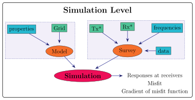
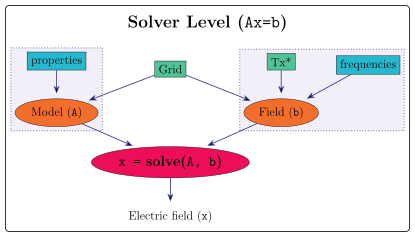
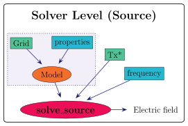
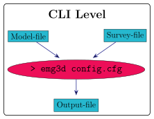

Getting started
===============

There are different usages of ``emg3d``. As an end user you might be interested
in the :ref:`high-level-usage`: define your survey and your model, and
simulate electromagnetic data for them. As a developer you might be interested
in the :ref:`solver-level-usage` or :ref:`cli-level-usage`, to implement emg3d
for instance as a forward modelling kernel in you inversion code. And then
there is also :ref:`time-level-usage`.

Here we show first an introductory example of the :ref:`high-level-usage`.
Further down you find an overview and more detailed explanation of the
different :ref:`usages`.

Basic Example
-------------

The following is a *very* basic example. To see some more realistic models have
a look at the `gallery <https://emsig.xyz/emg3d-gallery/gallery>`_. First, we
load ``emg3d``, ``numpy``, and ``matplotlib``. Note that this example requires
that you have installed ``discretize`` and ``xarray`` as well.

.. ipython::

  In [1]: import emg3d
     ...: import numpy as np
     ...: import matplotlib as mpl

One of the elementary ingredients for modelling is a model, in our case a
resistivity or conductivity model. emg3d is *not* a model builder. We just
construct here a very simple dummy model. You can see more realistic models in
the `models section <https://emsig.xyz/emg3d-gallery/gallery/models>`_ of the
gallery.

Grid
~~~~

We first build a simple four-quadrant grid, centred around the origin.

.. ipython::

  In [1]: hx = np.ones(2)*5000
     ...: grid = emg3d.TensorMesh(
     ...:         [[5000, 5000], [10000], [5000, 5000]], origin='CCC')
     ...: grid  # QC
  Out[1]:
     ...:
     ...:  TensorMesh: 4 cells
     ...:
     ...:                      MESH EXTENT             CELL WIDTH      FACTOR
     ...:  dir    nC        min           max         min       max      max
     ...:  ---   ---  ---------------------------  ------------------  ------
     ...:   x      2     -5,000.00      5,000.00  5,000.00  5,000.00    1.00
     ...:   y      1     -5,000.00      5,000.00 10,000.00 10,000.00    1.00
     ...:   z      2     -5,000.00      5,000.00  5,000.00  5,000.00    1.00

Model
~~~~~

We use the constructed grid to create a simple resistivity model:

.. ipython::

  In [1]: model = emg3d.Model(
     ...:     grid=grid,
     ...:     property_x=[1, 10, 0.3, 0.3],
     ...:     mapping='Resistivity'
     ...: )
     ...: model  # QC
  Out[1]: Model: resistivity; isotropic; 2 x 2 x 2 (4)

We defined an isotropic model in terms of resistivities, but through the
``mapping`` parameter one can also define a model in terms of conductivities or
the logarithms thereof.

Quick check how the model looks like:

.. ipython::

  @savefig basic_model.png width=4in
  In [1]: fig, ax = plt.subplots()
     ...: cf = ax.pcolormesh(
     ...:     grid.cell_centers_x/1e3,
     ...:     grid.cell_centers_z/1e3,
     ...:     model.property_x[:, 0, :].T,
     ...:     shading='nearest',
     ...:     norm=mpl.colors.LogNorm(),
     ...: )
     ...: fig.colorbar(cf)
     ...: ax.set_title(r'Depth slice ($\Omega$ m)');
     ...: ax.set_xlabel('Easting (km)');
     ...: ax.set_ylabel('Depth (km)');

So we have an upper halfspace of 0.3 Ohm.m, a lower-left quadrant of 1 Ohm.m,
and a lower-right quadrant of 10 Ohm.m.

Survey
~~~~~~

Now that we have a model we need to define our survey. Currently there are
three source types implemented,

- :class:`emg3d.electrodes.TxElectricDipole`;
- :class:`emg3d.electrodes.TxMagneticDipole`;
- :class:`emg3d.electrodes.TxElectricWire`;

and two receiver types,

- :class:`emg3d.electrodes.RxElectricPoint`;
- :class:`emg3d.electrodes.RxElectricPoint`.

We are going to define a simple survey with an electric dipole source and a
line of electric point receivers.

.. ipython::

  In [1]: source = emg3d.TxElectricDipole(
     ...:     coordinates=(-3000, 0, 0, 0, 0)  # x, y, z, azimuth, elevation
     ...: )
     ...:
     ...: offsets = np.linspace(-2000, 3000, 21)
     ...: receivers = emg3d.surveys.txrx_coordinates_to_dict(
     ...:     emg3d.RxElectricPoint,
     ...:     coordinates=(offsets, 0, 0, 0, 0),  # x, y, z, azimuth, elevation
     ...: )
     ...:
     ...: survey = emg3d.Survey(
     ...:     sources=source,
     ...:     receivers=receivers,
     ...:     frequencies=1.0,       # Hz
     ...: )
     ...:
     ...: survey  # QC

Simulation
~~~~~~~~~~

Now that we have a model and a survey we can define our simulation:

.. ipython::

  In [1]: sim = emg3d.Simulation(
     ...:     survey=survey,
     ...:     model=model,
     ...: )
     ...:
     ...: sim  # QC

From the output we see that we defined a survey with one source, 21 receivers,
and one frequency. We see that we have a model, defined as resistivity, which
consists of four cells. And we see that the simulation created a computational
grid of 96x48x64 cells.

A simulation takes many input parameters, and you should really read the API
reference of :class:`emg3d.simulations.Simulation`. Particularly important are
the gridding parameters, and as such it is highly recommended to also read
:func:`emg3d.meshes.construct_mesh`. The simulation will try its best to create
suitable computational grids. However, these are not necessarily the best ones,
and the user has to pay attention to the grid creation. Also, the default grids
will most likely be quite big, to be on the safe side. Providing suitable user
inputs can significantly reduce the grid sizes and therefore computational
time!

So lets check in more detail the computational grid it created:

.. ipython::

  In [1]: comp_model = sim.get_model(source='TxED-1', frequency=1.0)
     ...: comp_model.grid
  Out[1]:
     ...:
     ...:  TensorMesh: 294,912 cells
     ...:
     ...:                      MESH EXTENT             CELL WIDTH      FACTOR
     ...:  dir    nC        min           max         min       max      max
     ...:  ---   ---  ---------------------------  ------------------  ------
     ...:   x     96     -6,939.37     13,615.81     91.89  3,045.59    1.42
     ...:   y     48    -11,286.30     11,286.30     91.89  3,045.59    1.42
     ...:   z     64    -13,651.53      2,245.90     91.89  1,866.31    1.21

We can see that the grid extends further in the directions where there are
higher resistivities. For instance, in positive z we have 0.3 Ohm.m, so the
grid does only extend roughly to +2.2 km. In positive x and z as well as in
positive and negative y we have 10 Ohm.m, so the grid goes to over 10 km.

Computing the fields is now a simple command,

.. ipython::

  In [1]: sim.compute()

Results
~~~~~~~

Let's plot the electric field at receiver locations (the responses):

.. ipython::

  @savefig basic_receivers.png width=4in
  In [1]: responses = sim.data.synthetic.data.squeeze()
     ...: fig, ax = plt.subplots()
     ...: ax.semilogy(offsets/1e3, abs(responses.real), 'C0o-', label='|Real|')
     ...: ax.semilogy(offsets/1e3, abs(responses.imag), 'C1o-', label='|Imag|')
     ...: ax.legend()
     ...: ax.set_title('Electric field at receivers')
     ...: ax.set_xlabel('Easting (km)')
     ...: ax.set_ylabel('E-field (V/m)')

We can also get the entire electric field in a similar way as we got the
computational model, and plot it for QC:

.. ipython::

  @savefig basic_efield.png width=4in
  In [1]: efield = sim.get_efield(source='TxED-1', frequency=1.0)
     ...:
     ...: fig, ax = plt.subplots()
     ...: cf = ax.pcolormesh(
     ...:     efield.grid.cell_centers_x/1e3,
     ...:     efield.grid.nodes_z/1e3,
     ...:     abs(efield.fx[:, 24, :].T),
     ...:     shading='gouraud',
     ...:     norm=mpl.colors.LogNorm(vmin=1e-16, vmax=1e-8),
     ...: )
     ...: fig.colorbar(cf)
     ...: ax.set_xlim([-3.5, 4])
     ...: ax.set_ylim([-3, 1])
     ...: ax.set_title(r'|$E_x$| Field (V/m)');
     ...: ax.set_xlabel('Easting (km)');
     ...: ax.set_ylabel('Depth (km)');

This is frankly a *very* fast rundown, and many things are only scratched at
the surface or not explained at all. However, you should find much more
information and explanation in the rest of the manual, and many examples in the
gallery.

.. _usages:

Usage levels
------------

.. _high-level-usage:

Simulations / High-level usage
~~~~~~~~~~~~~~~~~~~~~~~~~~~~~~

   Workflow for the high-level usage: A **Simulation** needs a **Model** and a
   **Survey**. A survey contains all acquisition parameters such as sources,
   receivers, frequencies, and data, if available. A model contains the
   subsurface properties such as conductivities or resistivities, and the grid
   information.

Simulate responses for electric and magnetic receivers due to electric and
magnetic sources, in parallel. If data is provided it can also compute the
misfit and the gradient of the misfit function. It includes automatic, source
and frequency dependent gridding.

*Note:* In addition to ``emg3d`` this requires the soft dependency ``xarray``
(``tqdm`` and ``discretize`` are recommended).

.. _solver-level-usage:

Solver-level usage
~~~~~~~~~~~~~~~~~~

   Workflow for the solver-level usage: The **solve** function requires a
   **Model** ``A`` and a Source-**Field** ``b``. It then solves ``Ax=b`` and
   returns ``x``, the electric field, corresponding to the provided subsurface
   model and source field.

The solver level is the core of emg3d: It solves Maxwell's equations for the
provided subsurface model and the provided source field using the multigrid
method, returning the resulting electric field.

The function :func:`emg3d.solver.solve_source` simplifies the solver scheme. It
takes a model, a source, and a frequency, avoiding the need to generate the
source field manually, as shown in :numref:`Figure %s <solver-source-level>`.

   Simplified solver-level workflow: The **solve_source** function requires a
   **Model**, a **Source**, and a **frequency**. It generates the source field
   internally, and returns ``x``, the electric field, corresponding to the
   provided input.

*Note:* This requires only ``emg3d`` (``discretize`` is recommended).

.. _cli-level-usage:

Command-line interface (CLI-level)
~~~~~~~~~~~~~~~~~~~~~~~~~~~~~~~~~~

   CLI-level usage: file-driven command-line usage of the high-level
   (Simulation) functionality of emg3d.

The command-line interface is a terminal utility for the high-level
(Simulation) usage of emg3d. The model and the survey have to be provided as
files (HDF5, npz, or json), various settings can be defined in the config file,
and the output will be written to the output file (see also
:ref:`io-persistence`).

*Note:* In addition to ``emg3d`` this requires the soft dependency ``xarray``
(``tqdm`` and ``discretize`` are recommended), and ``h5py`` if the provided
files are in the HDF5 format.

.. _time-level-usage:

Time-domain modelling
~~~~~~~~~~~~~~~~~~~~~

Time-domain modelling with emg3d is possible, but it is not implemented in the
high-level class ``Simulation``. It has to be carried out by using
:class:`emg3d.time.Fourier`, together with the Solver-level usage mentioned
above. Have a look at the repo https://github.com/emsig/article-TDEM.

*Note:* In addition to ``emg3d`` this requires the soft dependency ``empymod``
(``discretize`` is recommended).
