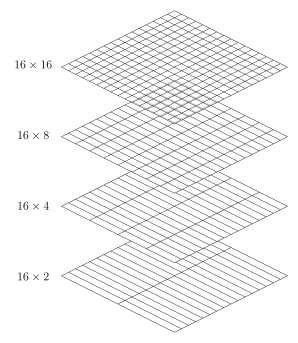

Multi-what?
###########

If you have never heard of the multigrid method before you might ask yourself
"*multi-what?*" The following is an intent to describe the multigrid method
without the maths; just some keywords and some figures. **It is a heavily
simplified intro, using a 2D grid for simplicity.** Have a look at the
:doc:`theory`-section for more details.

The multigrid method

- is an iterative solver;
- scales almost linearly (CPU & RAM);
- can serve as a pre-conditioner or as a solver on its own.

The main driving motivation to use multigrid is the part about linear scaling.

Matrix-free solver
------------------

The implemented multigrid method is a matrix free solver, it never constructs
the full matrix. This is how it achieves its relatively low memory consumption.
To solve the system, it solves for all fields adjacent to one node, moves then
to the next node, and so on until it reaches the last node, see :numref:`Figure
%s <smoother>`, where the red lines indicate the fields which are solved
simultaneously per step (the fields on the boundaries are never calculated, as
they are assumed to be 0).

   The multigrid solver solves by default on a node-by-node basis.

Normally, you would have to do this over and over again to achieve a good
approximate solution. multigrid typically does it only a few times per grid,
typically 2 times (one forward, one backward). This is why it is called
**smoother**, as it only smoothes the error, it does not solve it. The
implemented method for this is the :ref:`Gauss-Seidel` method.

Iterative solver which work in this matrix-free manner are typically very fast
at solving for the local problem, hence the *high frequency* error, but very
slow at solving the global problem, hence *low frequency* error. High and low
frequency errors are meant relatively to cell-size here.

Moving between different grids
------------------------------

The main thinking behind multigrid is now that we move to coarser grids. This
has two advantages:

- Fewer cells means faster calculation and less memory.
- Coarser grid size transforms lower frequency error to higher frequency error,
  relatively to cell size, which means faster convergence.

The implemented multigrid method simply joins two adjacent cells to get from
finer to coarser grids, see :numref:`Figure %s <fine2coarse>` for an example
coarsening starting with a 16 cells by 16 cells grid.

   Example of the implemented coarsening scheme.

There are different approaches how to cycle through different grid sizes, see
:numref:`Figures %s <Muld06_Fig3>` :numref:`to %s <Muld06_Fig5>`. The
downsampling from a finer grid to a coarser grid is often termed
**restriction**, whereas the interpolation from a coarser grid to a finer grid
is termed **prolongation**.

Specialities
------------

The convergence rate of the multigrid method suffers on severely stretched
grids or by models with strong anisotropy. Two techniques are implemented,
**semicoarsening** :numref:`(Figure %s) <semicoarsening>` and **line
relaxation** :numref:`(Figure %s) <linerelaxation>`. Both require more CPU and
higher RAM per grid than the standard multigrid, but they can improve the
convergence rate, which then in turn improves the overall CPU time.

   Example of semicoarsening: The cell size is kept constant in one direction.
   The direction can be alternated between iterations.

   Example of line relaxation: The system is solved for all fields adjacent to
   a whole line of nodes simultaneously in some direction. The direction can be
   alternated between iterations.
