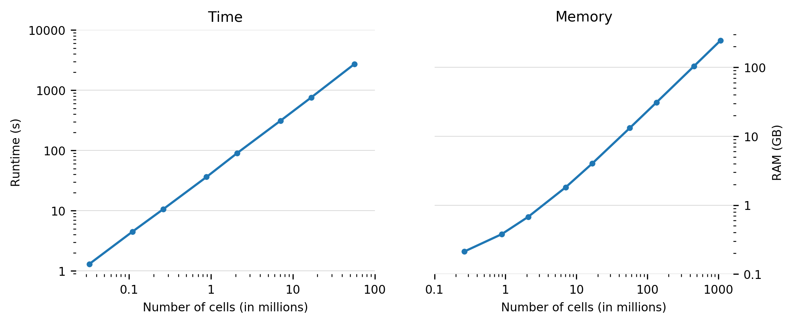

# Summary

Controlled-source electromagnetic (CSEM) surveys are a common geophysical
investigation tool in the search for, amongst other, groundwater, hydrocarbons,
and minerals. The numerical modelling of CSEM data requires the solution of the
Maxwell equations. These can be simplified in the particular case of CSEM, as
the frequencies used in surveys are usually sufficiently low to ignore any
displacement currents. A diffusive problem remains, which resulting system of
equations is given in the frequency domain by

$$ \eta \mathbf{E} - \nabla \times \mu_\mathrm{r}^{-1} \nabla \times \mathbf{E}
= -\mathrm{i}\omega\mu_0\mathbf{J}_\mathrm{s} \, ,$$

where $\eta = \mathrm{i}\omega \mu_0(\sigma - \mathrm{i}\omega\varepsilon)$.
The electric field and the current source are denoted as $\mathbf{E}$ and
$\mathbf{J}_\mathrm{s}$, respectively, $\sigma$ is conductivity, $\omega$ is
angular frequency, $\varepsilon=\varepsilon_0\varepsilon_\mathrm{r}$ the
electric permittivity, and $\mu=\mu_0\mu_\mathrm{r}$ the magnetic permeability.

Various open-source codes exist to model CSEM responses for a layered Earth,
e.g., *DIPOLE1D* [@DIPOLE1D] and *empymod* [@empymod], and for a
two-dimensional Earth, e.g., *MARE2DEM* [@MARE2DEM]. Open-source modellers for
a three-dimensional (3D) Earth only recently became available, notably *SimPEG*
[@SimPEG], *PETGEM* [@PETGEM], and *custEM* [@custEM]. SimPEG is a framework
that not only includes CSEM but also other geophysical methods and can model
them on various types of regular grids. It currently uses mostly the direct
solver *PARDISO* [@PARDISO]. PETGEM and custEM use finite elements with the
*FEniCS* solver [@FEniCS]. All three codes require substantial memory and are
not easily run on a laptop for models with several million cells.

@Mulder:2006 has shown that the multigrid method [@Briggs:2000], with its
optimal scaling for both runtime and memory consumption as shown in Figure 1,
works fine for diffusive CSEM problems. This was later also confirmed by others
[@Jaysaval:2016]. However, the multigrid CSEM codes of these publications are
proprietary. The code *emg3d* is a multigrid solver for 3D CSEM diffusion with
tri-axial electrical anisotropy using a staggered grid
[@Mulder:2006;@Mulder:2007]. It can act as a solver on its own, or be used as a
preconditioner for various Krylov subspace methods. Multigrid solvers can
struggle to converge with strong grid-stretching or strong anisotropy. We
implemented *semicoarsening* (coarsening the grid only in some coordinate
directions) and *line relaxation* (solving for the values of a whole gridline
simultaneously in some directions) inside the multigrid technique to deal with
these issues [@Jonsthovel:2006].

The code is written completely in Python using the NumPy/SciPy stack
[@NumPy;@SciPy], where the most time- and memory-consuming parts are sped up
through jitted functions using Numba [@Numba]. It can currently be used as a
stand-alone modeller or as a solver in conjunction with the SimPEG-framework.

# Acknowledgements

This code was developed within the Gitaro.JIM project funded through MarTERA as
part of Horizon 2020, a funding scheme of the European Research Area (ERA-NET
Cofund, https://www.martera.eu).

# References
