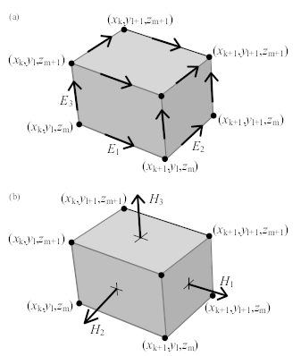
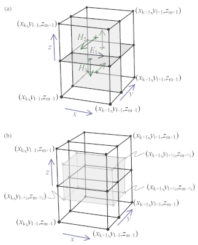
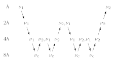

.. _Theory:

Theory
######

The following provides an introduction to the theoretical foundation of the
solver `emg3d`. More specific theory is covered in the docstrings of many
functions, have a look at the :doc:`code`-section or follow the links to the
corresponding functions here within the theory. If you just want to use the
solver, but do not care much about the internal functionality, then the
function :func:`emg3d.solver.solve` is the only function you will ever need. It
is the main entry point, and it takes care whether multigrid is used as a
solver or as a preconditioner (or not at all), while the actual multigrid
solver is :func:`emg3d.solver.multigrid`.

.. note::

    This section is not an independent piece of work. Most things are taken
    from one of the following sources:

    - [Muld06]_, pages 634-639:

      - The *Maxwell's equations* and *Discretisation* sections correspond with
        some adjustemens and additions to pages 634-636.
      - The start of *The Multigrid Method* corresponds roughly to page 637.
      - Pages 638 and 639 are in parts reproduced in the code-docstrings of the
        corresponding functions.

    - [BrHM00]_: This book is an excellent introduction to multigrid methods.
      Particularly the *Iterative Solvers* section is taken to a big extent
      from the book.

    **Please consult these original resources for more details, and refer to
    them for citation purposes and not to this manual.** More in-depth
    information can also be found in, e.g., [Hack85]_ and [Wess91]_.


Maxwell's equations
-------------------

Maxwell's equations in the presence of a current source
:math:`\mathbf{J}_\mathrm{s}` are

.. math::
    :label: maxwell

    \partial_{t} \mathbf{B}(\mathbf{x},t) +
    \nabla\times\mathbf{E}(\mathbf{x},t) &= 0 , \\
    \nabla \times \mathbf{H}(\mathbf{x}, t) -
    \partial_{t} \mathbf{D}(\mathbf{x}, t) &=
    \mathbf{J}_{\mathrm{c}}(\mathbf{x}, t) +
    \mathbf{J}_\mathrm{s}(\mathbf{x}, t) ,

where the conduction current :math:`\mathbf{J}_\mathrm{c}` obeys Ohm’s law,

.. math::
    :label: ohmslaw

    \mathbf{J}_{\mathrm{c}}(\mathbf{x},t) =
    \sigma(\mathbf{x})\mathbf{E}(\mathbf{x},t) .

Here, :math:`\sigma(\mathbf{x})` is the conductivity.
:math:`\mathbf{E}(\mathbf{x}, t)` is the electric field and
:math:`\mathbf{H}(\mathbf{x}, t)` is the magnetic field. The electric
displacement :math:`\mathbf{D}(\mathbf{x}, t) =
\varepsilon(\mathbf{x})\mathbf{E}(\mathbf{x}, t)` and the magnetic induction
:math:`\mathbf{B}(\mathbf{x}, t) = \mu(\mathbf{x})\mathbf{H}(\mathbf{x}, t)`.
The dielectric constant or permittivity :math:`\varepsilon` can be expressed as
:math:`\varepsilon = \varepsilon_r \varepsilon_0`, where :math:`\varepsilon_r`
is the relative permittivity and :math:`\varepsilon_0` is the vacuum value.
Similarly, the magnetic permeability :math:`\mu` can be written as :math:`\mu =
\mu_r\mu_0`, where :math:`\mu_r` is the relative permeability and :math:`\mu_0`
is the vacuum value.

The magnetic field can be eliminated from Equation :eq:`maxwell`, yielding the
second-order parabolic system of equations,

.. math::
    :label: combmax

    \varepsilon \partial_{t t} \mathbf{E} + \sigma \partial_{t} \mathbf{E} +
    \nabla \times \mu^{-1} \nabla \times \mathbf{E} =
    -\partial_{t} \mathbf{J}_{\mathrm{s}} .


To transform from the time domain to the frequency domain, we substitute

.. math::
    :label: fourierdef

    \mathbf{E} (\mathbf{x},t) = \frac{1}{2\pi} \int_{-\infty}^{\infty}
    \mathbf{\hat{E}} (\mathbf{x},\omega) e^{-\mathrm{i}\omega t}\, d\omega,

and use a similar representation for :math:`\mathbf{H}(\mathbf{x}, t)`. The
resulting system of equations is

.. math::
    :label: fdomain

    -s \mu_0(\sigma + s\varepsilon) \mathbf{\hat{E}} - \nabla \times
    \mu_r^{-1} \nabla \times \mathbf{\hat{E}} =
    s\mu_0\mathbf{\hat{J}}_s ,

where :math:`s = -\mathrm{i}\omega``. The multigrid method converges in the
case of the diffusive approximation (with its smoothing and approximation
properties), but not in the high-frequency range (at least not in the
implemented form of the multigrid method in ``emg3d``). The code ``emg3d``
assumes therefore the diffusive approximation, hence only low frequencies are
considered that obey :math:`|\omega\varepsilon| \ll \sigma`. In this case we
can set :math:`\varepsilon=0`, and Equation :eq:`fdomain` simplifies to

.. math::
    :label: fdomaindiff

    -s \mu_0 \sigma \mathbf{\hat{E}} - \nabla \times
    \mu_r^{-1} \nabla \times \mathbf{\hat{E}} =
    s\mu_0\mathbf{\hat{J}}_s ,


From here on, the hats are omitted. We use the perfectly electrically
conducting boundary

.. math::
    :label: pec

    \mathbf{n}\times\mathbf{E} = 0 \quad \text{and} \quad
    \mathbf{n}\cdot\mathbf{H} = 0 ,
     \label{eq:sample}

where :math:`\mathbf{n}` is the outward normal on the boundary of the domain.


The Maxwell's equations and Ohm's law are solved in the **frequency domain**.
The **time-domain** solution can be obtained by taking the inverse Fourier
transform.

.. note::

    [Muld06]_ uses the time convention :math:`e^{-\mathrm{i}\omega t}`, see
    Equation :eq:`fourierdef`, with :math:`s=-\mathrm{i}\omega`. However, the
    code `emg3d` uses the convention :math:`e^{\mathrm{i}\omega t}`, hence
    :math:`s=\mathrm{i}\omega`. This is the same convention as used in
    `empymod`, and commonly in CSEM.


Laplace domain
``````````````
It is also possible to solve the problem in the **Laplace domain**, by
using a real value for :math:`s` in Equation :eq:`fdomaindiff`, instead of the
complex value :math:`-\mathrm{i}\omega``. This simplifies the problem from
complex numbers to real numbers, which accelerates the computation. It also
improves the convergence rate, as the solution is a smoother function. The
solver :func:`emg3d.solver.solve` is agnostic to the data type of the provided
source field, and can solve for real and complex problems, hence frequency and
Laplace domain. See the documentation of the functions
:func:`emg3d.fields.get_source_field` and :func:`emg3d.models.Model` to see how
you can use `emg3d` for Laplace-domain computations.


Discretisation
--------------

Equation :eq:`fdomaindiff` can be discretised by the finite-integration
technique ([Weil77]_, [ClWe01]_). This scheme can be viewed as a finite-volume
generalization of [Yee66]_'s  scheme for tensor-product Cartesian grids with
variable grid spacings. An error analysis for the constant-coefficient case
([MoSu94]_) showed that both the electric and magnetic field components have
second-order accuracy.

Consider a tensor-product Cartesian grid with nodes at positions :math:`(x_k,
y_l, z_m)`, where :math:`k=0, \dots, N_x, l=0, \dots, N_y` and :math:`m=0,
\dots, N_z`. There are :math:`N_x\times N_y\times N_z` cells having these nodes
as vertices. The cell centres are located at

.. math::
    :label: cellcenters

    x_{k+1/2} &= {\textstyle \frac{1}{2}}\left(x_k + x_{k+1}\right) , \\
    y_{l+1/2} &= {\textstyle \frac{1}{2}}\left(y_l + y_{l+1}\right) , \\
    z_{m+1/2} &= {\textstyle \frac{1}{2}}\left(z_m + z_{m+1}\right) .

The material properties, :math:`\sigma` and :math:`\mu_\mathrm{r}`, are assumed
to be given as cell-averaged values. The electric field components are
positioned at the edges of the cells, as shown in :numref:`Figure %s
<Muld06_Fig1>`, in a manner similar to Yee’s scheme. The first component of the
electric field :math:`E_{1, k+1/2, l, m}` should approximate the average of
:math:`E_1(x, y_l, z_m)` over the edge from :math:`x_k` to :math:`x_{k+1}` at
given :math:`y_l` and :math:`z_m`. Here, the average is defined as the line
integral divided by the length of the integration interval. The other
components, :math:`E_{2, k, l+1/2, m}` and :math:`E_{3, k, l, m+1/2}`, are
defined in a similar way. Note that these averages may also be interpreted as
point values at the midpoint of edges:

.. math::
    :label: edgepoints

    E_{1, k+1/2, l, m} \simeq E_1\left(x_{k+1/2}, y_{l}, z_{m}\right) , \\
    E_{2, k, l+1/2, m} \simeq E_2\left(x_{k}, y_{l+1/2}, z_{m}\right) , \\
    E_{3, k, l, m+1/2} \simeq E_3\left(x_{k}, y_{l}, z_{m+1/2}\right) .

The averages and point-values are the same within second-order accuracy.



   (a) A grid cell with grid nodes and edge-averaged components of the electric
   field. (b) The face-averaged magnetic field components that are obtained by
   taking the curl of the electric field.


For the discretisation of the term :math:`-s\mu_0\sigma\mathbf{E}` related to
Ohm's law, dual volumes related to edges are introduced. For a given edge, the
dual volume is a quarter of the total volume of the four adjacent cells. An
example for :math:`E_1` is shown in :numref:`Figure %s(b) <Muld06_Fig2>`. The
vertices of the dual cell are located at the midpoints of the cell faces.



   The first electric field component :math:`E_{1,k,l,m}` is located at the
   intersection of the four cells shown in (a). Four faces of its dual volume
   are sketched in (b). The first component of the curl of the magnetic field
   should coincide with the edge on which :math:`E_1` is located. The four
   vectors that contribute to this curl are shown in (a). They are defined as
   normals to the four faces in (a). Before computing their curl, these vectors
   are interpreted as tangential components at the faces of the dual volume
   shown in (b). The curl is evaluated by taking the path integral over a
   rectangle of the dual volume that is obtained for constant x and by
   averaging over the interval :math:`[x_k,x_{k+1}]`.

The volume of a normal cell is defined as

.. math::
    :label: volnormalcell

    V_{k+1/2, l+1/2, m+1/2} = h_{k+1/2}^x h_{l+1/2}^y h_{m+1/2}^z ,

where

.. math::
    :label: cellwidths

    h_{k+1/2}^x &= x_{k+1}-x_k , \\
    h_{l+1/2}^y &= y_{l+1}-y_l , \\
    h_{m+1/2}^z &= z_{m+1}-z_m .

For an edge parallel to the x-axis on which :math:`E_{1, k+1/2, l, m}` is
located, the dual volume is

.. math::
    :label: dualvolume

    V_{k+1/2, l, m} = {\textstyle \frac{1}{4}} h_{k+1/2}^x
                      \sum_{m_2=0}^1 \sum_{m_3=0}^1
                      h_{l-1/2+m_2}^y h_{m-1/2+m_3}^z .

With the definitions,

.. math::
    :label: dualcellwidths

    d_k^x &= x_{k+1/2} - x_{k-1/2} , \\
    d_l^y &= y_{l+1/2} - y_{l-1/2} , \\
    d_m^z &= z_{m+1/2} - z_{m-1/2} ,

we obtain

.. math::
    :label: discdualvol

    V_{k+1/2, l, m} &= h_{k+1/2}^x d_l^y d_m^z , \\
    V_{k, l+1/2, m} &= d_k^x h_{l+1/2}^y d_m^z , \\
    V_{k, l, m+1/2} &= d_k^x d_l^y h_{m+1/2}^z .

Note that Equation :eq:`dualcellwidths` does not define :math:`d_k^x`, etc., at
the boundaries. We may simply take :math:`d^x_0 = h^x_{1/2}` at :math:`k = 0`,
:math:`d^x_{N_x} = h^x_{N_x-1/2}` at :math:`k = N_x` and so on, or use half of
these values as was done by [MoSu94]_.

The discrete form of the term :math:`-s\mu_0\sigma\mathbf{E}` in Equation
:eq:`fdomaindiff`, with each component multiplied by the corresponding dual
volume, becomes :math:`\mathcal{S}_{k+1/2, l, m}\ E_{1, k+1/2, l, m}`,
:math:`\mathcal{S}_{k, l+1/2, m}\ E_{2, k, l+1/2, m}` and
:math:`\mathcal{S}_{k, l, m+1/2}\ E_{3, k, l, m+1/2}` for the first, second and
third components, respectively. Here :math:`\mathcal{S} = -s\mu_0\sigma V` is
defined in terms of cell-averages. At the edges parallel to the x-axis, an
averaging procedure similar to :eq:`dualvolume` gives

.. math::
    :label: sterm

    \mathcal{S}_{k+1/2, l, m} = &{\textstyle\frac{1}{4}}\left(
    \mathcal{S}_{k+1/2, l-1/2, m-1/2} +
    \mathcal{S}_{k+1/2, l+1/2, m-1/2} \right. \\ &+ \left.
    \mathcal{S}_{k+1/2, l-1/2, m+1/2} +
    \mathcal{S}_{k+1/2, l+1/2, m+1/2} \right) .

:math:`\mathcal{S}_{k, l+1/2, m}` and :math:`\mathcal{S}_{k, l, m+1/2}` are
defined in a similar way.

The curl of :math:`\mathbf{E}` follows from path integrals around the edges
that bound a face of a cell, drawn in :numref:`Figure %s(a) <Muld06_Fig1>`.
After division by the area of the faces, the result is a face-averaged value
that can be positioned at the centre of the face, as sketched in
:numref:`Figure %s(b) <Muld06_Fig1>`. If this result is divided by
:math:`\mathrm{i}\omega\mu`, the component of the magnetic field that is normal
to the face is obtained. In order to find the curl of the magnetic field, the
magnetic field components that are normal to faces are interpreted as
tangential components at the faces of the dual volumes. For :math:`E_1`, this
is shown in :numref:`Figure %s <Muld06_Fig2>`. For the first component of
Equation :eq:`fdomaindiff` on the edge :math:`(k+1/2, l, m)` connecting
:math:`(x_k, y_l, z_m)` and :math:`(x_{k+1}, y_l, z_m)`, the corresponding dual
volume comprises the set :math:`[x_k, x_{k+1}] \times [y_{l-1/2}, y_{l+1/2}]
\times [z_{m-1/2}, z_{m+1/2}]` having volume :math:`V_{k+1/2,l,m}`.

The scaling by :math:`\mu_r^{-1}` at the face requires another averaging step
because the material properties are assumed to be given as cell-averaged
values. We define :math:`\mathcal{M} = V\mu_r^{-1}`, so

.. math::
    :label: mterm

    \mathcal{M}_{k+1/2, l+1/2, m+1/2} = 
    h_{k+1/2}^x h_{l+1/2}^y h_{m+1/2}^z \mu_{r, k+1/2, l+1/2, m+1/2}^{-1}

for a given cell :math:`(k+1/2, l+1/2, m+1/2)`. An averaging step in, for
instance, the z-direction gives 

.. math::
    :label: mtermz

    \mathcal{M}_{k+1/2, l+1/2, m} = {\textstyle \frac{1}{2}}
    \left(\mathcal{M}_{k+1/2, l+1/2, m-1/2} + \mathcal{M}_{k+1/2, l+1/2, m+1/2}
    \right)

at the face :math:`(k+1/2, l+1/2, m)` between the cells :math:`(k+1/2, l+1/2,
m-1/2)` and :math:`(k+1/2, l+1/2, m+1/2)`.

Starting with :math:`\mathbf{v}=\nabla \times \mathbf{E}`, we have

.. math::
    :label: vterm

    v_{1, k, l+1/2, m+1/2} &=
    e_{l+1/2}^y\left(E_{3, k, l+1, m+1/2} - E_{3, k, l, m+1/2}\right) \\
    &-e_{m+1/2}^z\left(E_{2, k, l+1/2, m+1} - E_{2, k, l+1/2, m}\right) , \\
    v_{2, k+1/2, l, m+1/2} &=
    e_{m+1/2}^z\left(E_{1, k+1/2, l, m+1} - E_{1, k+1/2, l, m}\right) \\
    &-e_{k+1/2}^x\left(E_{3, k+1, l, m+1/2} - E_{3, k, l, m+1/2}\right) , \\
    v_{3, k+1/2, l+1/2, m} &=
    e_{k+1/2}^x\left(E_{2, k+1/2, l+1, m} - E_{1, k+1/2, l, m}\right) \\
    &-e_{l+1/2}^y\left(E_{1, k+1/2, l+1, m} - E_{1, k+1/2, l, m}\right) .

Here,

.. math::
    :label: eterm


    e_{k+1/2}^x = 1/h_{k+1/2}^x, \quad
    e_{l+1/2}^y = 1/h_{l+1/2}^y, \quad
    e_{m+1/2}^z = 1/h_{m+1/2}^z .

Next, we let

.. math::
    :label: uterm

    u_{1,k,l+1/2,m+1/2} &= \mathcal{M}_{k,l+1/2,m+1/2} v_{1,k,l+1/2,m+1/2} , \\
    u_{2,k+1/2,l,m+1/2} &= \mathcal{M}_{k+1/2,l,m+1/2} v_{2,k+1/2,l+1/2,m} , \\
    u_{3,k+1/2,l+1/2,m} &= \mathcal{M}_{k+1/2,l+1/2,m} v_{3,k+1/2,l+1/2,m} .

Note that these components are related to the magnetic field components by

.. math::
    :label: utermmag

    u_{1,k,l+1/2,m+1/2} &=
    \mathrm{i}\omega\mu_0 V_{k,l+1/2,m+1/2} H_{1,k+1/2,l,m+1/2} , \\
    u_{2,k+1/2,l,m+1/2} &=
    \mathrm{i}\omega\mu_0 V_{k+1/2,l,m+1/2} H_{2,k+1/2,l,m+1/2} , \\
    u_{3,k+1/2,l+1/2,m} &=
    \mathrm{i}\omega\mu_0 V_{k+1/2,l+1/2,m} H_{3,k+1/2,l+1/2,m} ,

where

.. math::
    :label: utermmagV

    V_{k,l+1/2,m+1/2} &= d_k^x h_{l+1/2}^y h_{m+1/2}^z , \\
    V_{k+1/2,l,m+1/2} &= h_{k+1/2}^x d_l^y h_{m+1/2}^z , \\
    V_{k+1/2,l+1/2,m} &= h_{k+1/2}^x h_{l+1/2}^y d_m^z .

The discrete representation of the source term
:math:`\mathrm{i}\omega\mu_0\mathbf{J}_\mathrm{s}`, multiplied by the
appropriate dual volume, is

.. math::
    :label: discsource

    s_{1,k+1/2,l,m} &= \mathrm{i}\omega\mu_0 V_{k+1/2,l,m} J_{1,k+1/2,l,m} , \\
    s_{2,k,l+1/2,m} &= \mathrm{i}\omega\mu_0 V_{k,l+1/2,m} J_{2,k,l+1/2,m} , \\
    s_{3,k,l,m+1/2} &= \mathrm{i}\omega\mu_0 V_{k,l,m+1/2} J_{3,k,l,m+1/2} .

Let the residual for an arbitrary electric field that is not necessarily a
solution to the problem be defined as

.. math::
    :label: residualeq

    \mathbf{r} = V \left(\mathrm{i} \omega \mu_0 \mathbf{J}_\mathrm{s} +
    -s\mu_0\sigma \mathbf{E} -
    \nabla \times \mu^{-1}_\mathrm{r} \nabla \times \mathbf{E}\right) .

Its discretisation is

.. math::
    :label: discres

    r_{1,k+1/2,l,m} =
        ~&s_{1,k+1/2,l,m} + \mathcal{S}_{k+1/2,l,m} E_{1,k+1/2,l,m} \\
    &-\left[e_{l+1/2}^y u_{3,k+1/2,l+1/2,m} -
        e_{l-1/2}^y u_{3,k+1/2,l-1/2,m]}\right.\\
    &+\left[e_{m+1/2}^z u_{2,k+1/2,l,m+1/2} -
        e_{m-1/2}^z u_{2,k+1/2,l,m-1/2}\right] , \\
    %
    r_{2,k,l+1/2,m} =
        ~&s_{2,k,l+1/2,m} + \mathcal{S}_{k,l+1/2,m} E_{2,k,l+1/2,m} \\
    &-\left[e_{m+1/2}^z u_{1,k,l+1/2, m+1/2} -
        e_{m-1/2}^z u_{1,k,l+1/2,m-1/2]} \right. \\
    &+\left[e_{k+1/2}^x u_{3,k+1/2,l+1/2,m} -
        e_{k-1/2}^x u_{3,k-1/2,l+1/2,m]}\right] , \\
    %
    r_{3,k,l,m+1/2} =
        ~&s_{3,k,l,m+1/2} + \mathcal{S}_{k,l,m+1/2} E_{3,k,l,m+1/2} \\
    &-\left[e_{k+1/2}^x u_{2,k+1/2,l,m+1/2} -
        e_{k-1/2}^x u_{2,k-1/2,m+1/2]}\right.\\
    &+\left[e_{l+1/2}^y u_{1,k,l+1/2,m+1/2} -
        e_{l-1/2}^y u_{1,k,l-1/2,m+1/2}\right] .

The weighting of the differences in :math:`u_1`, etc., may appear strange. The
reason is that the differences have been multiplied by the local dual volume.
As already mentioned, the dual volume for :math:`E_{1,k,l,m}` is shown in
:numref:`Figure %s(b) <Muld06_Fig2>`.

For further details of the discretisation see [Muld06]_ or [Yee66]_. The actual
meshing is done using `discretize <http://discretize.simpeg.xyz>`_ (part of the
`SimPEG <https://simpeg.xyz>`_-framework). The coordinate system of
``discretize`` uses a coordinate system were positive z is upwards.

The method is implemented in a matrix-free manner: the large sparse linear
matrix that describes the discretised problem is never explicitly formed, only
its action is evaluated on the latest estimate of the solution, thereby
reducing storage requirements.


Iterative Solvers
-----------------

The multigrid method is an iterative (or relaxation) method and shares as such
the underlying idea of iterative solvers. We want to solve the linear equation
system

.. math::
    :label: system

    A \mathbf{x} = \mathbf{b} ,

where :math:`A` is the :math:`n\times n` system matrix and :math:`x` the
unknown. If :math:`v` is an approximation to :math:`x`, then we can define two
important measures. One is the error :math:`e`

.. math::
    :label: error

    \mathbf{e} = \mathbf{x} - \mathbf{v} ,

which magnitude can be measured by any standard vector norm, for instance
the maximum norm and the Euclidean or 2-norm defined respectively, by

.. math::

    \|\mathbf{e}\|_\infty = \max_{1\leq j \leq n}|e_j|
    \quad \text{and} \quad
    \|\mathbf{e}\|_{2} = \sqrt{\sum_{j=1}^{n} e_{j}^{2}} .

However, as the solution is not known the error cannot be computed either.
The second important measure, however, is a computable measure, the residual
:math:`r` (computed in :func:`emg3d.solver.residual`)


.. math::
    :label: residual

    \mathbf{r} = \mathbf{b} - A\mathbf{v} .

Using Equation :eq:`error` we can rewrite Equation :eq:`system` as

.. math::

    A\mathbf{e} = \mathbf{b} - A\mathbf{v} ,

from which we obtain with Equation :eq:`residual` the *Residual Equation*

.. math::
    :label: reseq

    A\mathbf{e} = \mathbf{r} .

The *Residual Correction* is given by

.. math::
    :label: rescorr

    \mathbf{x} = \mathbf{v}+\mathbf{e} .


The Multigrid Method
--------------------

.. note::

    If you have never heard of multigrid methods before you might want to read
    through the :doc:`mgwhat`-section.

Multigrid is a numerical technique for solving large, often sparse, systems of
equations, using several grids at the same time. An elementary introduction can
be found in [BrHM00]_. The motivation for this approach follows from the
observation that it is fairly easy to determine the local, short-range
behaviour of the solution, but more difficult to find its global, long-range
components. The local behaviour is characterized by oscillatory or rough
components of the solution. The slowly varying smooth components can be
accurately represented on a coarser grid with fewer points. On coarser grids,
some of the smooth components become oscillatory and again can be easily
determined.

The following constituents are required to carry out multigrid. First, a
sequence of grids is needed. If the finest grid on which the solution is to be
found has a constant grid spacing :math:`h`, then it is natural to define
coarser grids with spacings of :math:`2h`, :math:`4h`, etc. Let the problem on
the finest grid be defined by :math:`A^h \mathbf{x}^h = \mathbf{b}^h`. The
residual is :math:`\mathbf{r}^h = \mathbf{b}^h - A^h \mathbf{x}^h` (see the
corresponding function :func:`emg3d.solver.residual`, and for more details
also the function :func:`emg3d.core.amat_x`). To find the oscillatory
components for this problem, a smoother or relaxation scheme is applied. Such a
scheme is usually based on an approximation of :math:`A^h` that is easy to
invert. After one or more smoothing steps (see the corresponding function
:func:`emg3d.solver.smoothing`), say :math:`\nu_1` in total, convergence will
slow down because it is generally difficult to find the smooth, long-range
components of the solution. At this point, the problem is mapped to a coarser
grid, using a restriction operator :math:`\tilde{I}^{2h}_h` (see the
corresponding function :func:`emg3d.solver.restriction`, and for more details,
the functions :func:`emg3d.core.restrict_weights` and
:func:`emg3d.core.restrict`. On the coarse-grid, :math:`\mathbf{b}^{2h} =
\tilde{I}^{2h}_h\mathbf{r}^h`. The problem :math:`\mathbf{r}^{2h} =
\mathbf{b}^{2h} - A^{2h} \mathbf{x}^{2h} = 0` is now solved for
:math:`\mathbf{x}^{2h}`, either by a direct method if the number of points is
sufficiently small or by recursively applying multigrid. The resulting
approximate solution needs to be interpolated back to the fine grid and added
to the solution. An interpolation operator :math:`I^h_{2h}`, usually called
prolongation in the context of multigrid, is used to update :math:`\mathbf{x}^h
:= \mathbf{x}^h + I^h_{2h}\mathbf{x}^{2h}` (see the corresponding function
:func:`emg3d.solver.prolongation`). Here :math:`I^h_{2h}\mathbf{x}^{2h}` is
called the coarse-grid correction. After prolongation, :math:`\nu_2` additional
smoothing steps can be applied. This constitutes one multigrid iteration.

So far, we have not specified the coarse-grid operator :math:`A^{2h}`. It can
be formed by using the same discretisation scheme as that applied on the fine
grid. Another popular choice, :math:`A^{2h} = \tilde{I}^{2h}_h A^h I^h_{2h}`,
has not been considered here. Note that the tilde is used to distinguish
restriction of the residual from operations on the solution, because these act
on elements of different function spaces.

If multigrid is applied recursively, a strategy is required for moving through
the various grids. The simplest approach is the V-cycle shown in
:numref:`Figure %s <Muld06_Fig3>` for the case of four grids. Here, the same
number of pre- and post-smoothing steps is used on each grid, except perhaps on
the coarsest. In many cases, the V-cycle does not solve the coarse-grid
equations sufficiently well. The W-cycle, shown in :numref:`Figure %s
<Muld06_Fig4>`, will perform better in that case. In a W-cycle, the number of
coarse-grid corrections is doubled on subsequent coarser grids, starting with
one coarse-grid correction on the finest grid. Because of its cost, it is often
replaced by the F-cycle :numref:`(Figure %s) <Muld06_Fig5>`. In the F-cycle, the
number of coarse-grid corrections increases by one on each subsequent coarser
grid.


   V-cycle with :math:`\nu_1` pre-smoothing steps and :math:`\nu_2`
   post-smoothing steps. On the coarsest grid, :math:`\nu_c` smoothing steps
   are applied or an exact solver is used. The finest grid has a grid spacing
   :math:`h` and the coarsest :math:`8h`. A single coarse-grid correction is
   computed for all grids but the coarsest.



   W-cycle with :math:`\nu_1` pre-smoothing steps and :math:`\nu_2`
   post-smoothing steps. On each grid except the coarsest, the number of
   coarse-grid corrections is twice that of the underlying finer grid.


   F-cycle with :math:`\nu_1` pre-smoothing steps and :math:`\nu_2`
   post-smoothing steps. On each grid except the coarsest, the number of
   coarse-grid corrections increases by one compared to the underlying finer
   grid.

One reason why multigrid methods may fail to reach convergence is strong
anisotropy in the coefficients of the governing partial differential equation
or severely stretched grids (which has the same effect as anisotropy). In that
case, more sophisticated smoothers or coarsening strategies may be required.
Two strategies are currently implemented, *semicoarsening* and *line
relaxation*, which can be used on their own or combined. Semicoarsening is when
the grid is only coarsened in some directions. Line relaxation is when in some
directions the whole gridlines of values are found simultaneously. If slow
convergence is caused by just a few components of the solution, a Krylov
subspace method can be used to remove them. In this way, multigrid is
accelerated by a Krylov method. Alternatively, multigrid might be viewed as a
preconditioner for a Krylov method.


.. _Gauss-Seidel:

Gauss-Seidel
````````````

The smoother implemented in ``emg3d`` is a Gauss-Seidel smoother. The
Gauss-Seidel method solves the linear equation system :math:`A \mathbf{x} =
\mathbf{b}` iteratively using the following method:

.. math::
    :label: gaussseidel

    \mathbf{x}^{(k+1)} = L_*^{-1} \left(\mathbf{b} - U \mathbf{x}^{(k)} \right)
    \ ,

where :math:`L_*` is the lower triangular component, and :math:`U` the strictly
upper triangular component, :math:`A = L_* + U`. On the coarsest grid it acts
as direct solver, whereas on the finer grid it acts as a smoother with only few
iterations.

See the function :func:`emg3d.solver.smoothing`, and for more details, the
functions :func:`emg3d.core.gauss_seidel`,
:func:`emg3d.core.gauss_seidel_x`, :func:`emg3d.core.gauss_seidel_y`,
:func:`emg3d.core.gauss_seidel_z`, and also
:func:`emg3d.core.blocks_to_amat`.


Choleski factorisation
``````````````````````

The actual solver of the system :math:`A\mathbf{x}=\mathbf{b}` is a
non-standard Cholesky factorisation without pivoting for a symmetric, complex
matrix :math:`A` tailored to the problem of the multigrid solver, using only
the main diagonal and five lower off-diagonals of the banded matrix :math:`A`.
The result is the same as simply using, e.g., :func:`numpy.linalg.solve`, but
faster for the particular use-case of this code.

See :func:`emg3d.core.solve` for more details.
