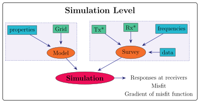

About
=====

The code ``emg3d`` ([WeMS19]_) is a three-dimensional modeller for
electromagnetic (EM) diffusion as used, for instance, in controlled-source EM
(CSEM) surveys frequently applied in the search for, amongst other,
groundwater, geothermal sources, hydrocarbons, and minerals.

The core of the code is primarily based on [Muld06]_, [Muld07]_, and [Muld08]_.
You can read more about the background of the code in the chapter
:doc:`credits`. An introduction to the underlying theory of multigrid methods
is given in the chapter :doc:`theory`, and further literature is provided in
the :doc:`references`. The code is currently restricted to regular, stretched
grids. As a matrix-free multigrid solver it scales linearly with the number of
cells for both CPU and RAM. This makes it possible to use emg3d for models with
several millions of cells on a regular laptop.

What is emg3d? (Features)
-------------------------

- A community driven, open-source 3D CSEM modelling tool.
- It can handle **entire surveys** with **many sources, receivers, and
  frequencies**, computing the solution in **parallel**.
- Can model electric and magnetic dipoles and arbitrarily shaped electric
  wires.
- Computes the **gradient of the misfit function** using the adjoint-state
  method.
- **Iterative, matrix-free multigrid solver**, scaling linearly (CPU & RAM)
  with the number of unknowns, O(N).
- Uses **regular, stretched grids**.
- Handles **triaxial electrical anisotropy**, isotropic electric permittivity,
  and isotropic magnetic permeability.
- Written **purely in Python** using the NumPy/SciPy-stack, where the most time-
  and memory-consuming parts are sped up through jitted **Numba**-functions;
  works **cross-platform** on Linux, Mac, and Windows.
- Can solve in the complex-valued **frequency domain** or the real-valued
  **Laplace domain**. Includes routines to compute the 3D EM field in the
  **time domain**.
- **Command-line interface (CLI)**, through which emg3d can be used as forward
  modelling kernel in inversion routines.

What is it _not_?
-----------------

- The code is meant to be used in Python or in a terminal. There is **no** GUI.
- Some knowledge of EM fields is definitely helpful, as GIGO applies («garbage
  in, garbage out»). For example, placing your receivers very close to the
  computational boundary *will* result in bad or wrong responses.

Usages
------

Simulations / High-level usage
~~~~~~~~~~~~~~~~~~~~~~~~~~~~~~

   Workflow for the high-level usage: A **Simulation** needs a **Model** and a
   **Survey**. A survey contains all acquisition parameters such as sources,
   receivers, frequencies, and data, if available. A model contains the
   subsurface properties such as conductivities or resistivities, and the grid
   information.

Simulate responses for electric and magnetic receivers due to electric and
magnetic sources, in parallel. If data is provided it can also compute the
misfit and the gradient of the misfit function. It includes automatic, source
and frequency dependent gridding.

*Note:* In addition to ``emg3d`` this requires the soft dependency ``xarray``
(``tqdm`` and ``discretize`` are recommended).

Solver-level usage
~~~~~~~~~~~~~~~~~~~~~~~~~~~~~~

.. figure:: ../_static/levels2.svg
   :align: center
   :alt: Solver-level usage
   :name: solver-level

   Workflow for the solver-level usage: The **solve** function requires a
   **Model** ``A`` and a Source-**Field** ``b``. It then solves ``Ax=b`` and
   returns ``x``, the electric field, corresponding to the provided subsurface
   model and source field.

The solver level is the core of emg3d: It solves Maxwell's equations for the
provided subsurface model and the provided source field using the multigrid
method, returning the resulting electric field.

*Note:* This requires only ``emg3d`` (``discretize`` is recommended).

Command-line interface (CLI-level)
~~~~~~~~~~~~~~~~~~~~~~~~~~~~~~~~~~

.. figure:: ../_static/levels3.svg
   :align: center
   :alt: CLI-level usage
   :name: cli-level

   CLI-level usage: file-driven command-line usage of the high-level
   (Simulation) functionality of emg3d.

The command-line interface is a terminal utility for the high-level
(Simulation) usage of emg3d. The model and the survey have to be provided as
files (HDF5, npz, or json), various settings can be defined in the config file,
and the output will be written to the output file.

*Note:* In addition to ``emg3d`` this requires the soft dependency ``xarray``
(``tqdm`` and ``discretize`` are recommended), and ``h5py`` if the provided
files are in the HDF5 format.

Time-domain modelling
~~~~~~~~~~~~~~~~~~~~~

Time-domain modelling with emg3d is possible, but it is not implemented in the
high-level class ``Simulation``. It has to be carried out by using
:class:`emg3d.time.Fourier`, together with the Solver-level usage mentioned
above. Have a look at the repo https://github.com/emsig/article-TDEM.

*Note:* In addition to ``emg3d`` this requires the soft dependency ``empymod``
(``discretize`` is recommended).
