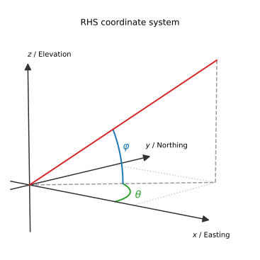

Getting started
===============

Basic Example
-------------

Here we show a *very* basic example. To see some more realistic models have a
look at the `gallery <https://emsig.github.io/emg3d-gallery>`_. This
particular example is also there, with some further explanations and examples
to show how to plot the model and the data; see `«Minimum working example»
<https://emsig.github.io/emg3d-gallery/gallery/tutorials/minimum_example.html>`_.
It also contains an example without using ``discretize``.

First, we load ``emg3d`` and ``discretize`` (to create a mesh), along with
``numpy``:

.. ipython::

    In [1]: import emg3d
       ...: import numpy as np
       ...: from matplotlib.colors import LogNorm

First, we define the mesh (see :class:`discretize.TensorMesh` for more info).
In reality, this task requires some careful considerations. E.g., to avoid edge
effects, the mesh should be large enough in order for the fields to dissipate,
yet fine enough around source and receiver to accurately model them. This grid
is too small, but serves as a minimal example.

.. ipython::

    In [2]: grid = emg3d.TensorMesh(
       ...:         h=[[(25, 10, -1.04), (25, 28), (25, 10, 1.04)],
       ...:            [(50, 8, -1.03), (50, 16), (50, 8, 1.03)],
       ...:            [(30, 8, -1.05), (30, 16), (30, 8, 1.05)]],
       ...:         origin='CCC')
       ...: grid
    Out[2]:
       ...:   TensorMesh: 49,152 cells
       ...:
       ...:                       MESH EXTENT             CELL WIDTH      FACTOR
       ...:   dir    nC        min           max         min       max      max
       ...:   ---   ---  ---------------------------  ------------------  ------
       ...:    x     48       -662.16        662.16     25.00     37.01    1.04
       ...:    y     32       -857.96        857.96     50.00     63.34    1.03
       ...:    z     32       -540.80        540.80     30.00     44.32    1.05

Next we define a very simple fullspace model with
:math:`\rho_x=1.5\,\Omega\,\text{m}`, :math:`\rho_y=1.8\,\Omega\,\text{m}`, and
:math:`\rho_z=3.3\,\Omega\,\text{m}`. The source is an x-directed dipole at the
origin, with a 10 Hz signal of 1 A.

.. ipython::

    In [3]: model = emg3d.Model(grid, property_x=1.5, property_y=1.8,
       ...:                     property_z=3.3, mapping='Resistivity')
       ...: model
    Out[3]:    Model [resistivity]; triaxial; 48 x 32 x 32 (49,152)

    In [4]: sfield = emg3d.get_source_field(grid=grid, source=[0, 0, 0, 0, 0], frequency=10)

Now we can compute the electric field with ``emg3d``:

.. ipython::

    In [5]: efield = emg3d.solve(model=model, sfield=sfield, verb=4)
    Out[5]:
       ...: :: emg3d START :: 13:56:59 :: v0.17.1.dev18+gf20d741.d20210309
       ...:
       ...:    MG-cycle       : 'F'                 sslsolver : False
       ...:    semicoarsening : False [0]           tol       : 1e-06
       ...:    linerelaxation : False [0]           maxit     : 50
       ...:    nu_{i,1,c,2}   : 0, 2, 1, 2          verb      : 4
       ...:    Original grid  :  48 x  32 x  32     => 49,152 cells
       ...:    Coarsest grid  :   3 x   2 x   2     => 12 cells
       ...:    Coarsest level :   4 ;   4 ;   4   
       ...:
       ...:    [hh:mm:ss]  rel. error                  [abs. error, last/prev]   l s
       ...:
       ...:        h_
       ...:       2h_ \                  /
       ...:       4h_  \          /\    / 
       ...:       8h_   \    /\  /  \  /  
       ...:      16h_    \/\/  \/    \/   
       ...:
       ...:    [13:56:59]   2.623e-02  after   1 F-cycles   [1.464e-06, 0.026]   0 0
       ...:    [13:57:00]   2.253e-03  after   2 F-cycles   [1.258e-07, 0.086]   0 0
       ...:    [13:57:00]   3.051e-04  after   3 F-cycles   [1.704e-08, 0.135]   0 0
       ...:    [13:57:00]   5.500e-05  after   4 F-cycles   [3.071e-09, 0.180]   0 0
       ...:    [13:57:01]   1.170e-05  after   5 F-cycles   [6.531e-10, 0.213]   0 0
       ...:    [13:57:01]   2.745e-06  after   6 F-cycles   [1.532e-10, 0.235]   0 0
       ...:    [13:57:01]   6.873e-07  after   7 F-cycles   [3.837e-11, 0.250]   0 0
       ...:
       ...:    > CONVERGED
       ...:    > MG cycles        : 7
       ...:    > Final rel. error : 6.873e-07
       ...:
       ...: :: emg3d END   :: 13:57:01 :: runtime = 0:00:02

So the computation required seven multigrid F-cycles and took just a bit more
than 2 seconds. It was able to coarsen in each dimension four times, where the
input grid had 49,152 cells, and the coarsest grid had 12 cells.

.. ipython::

    @savefig basic_example.png width=4in
    In [6]: grid.plot_slice(efield.field, normal='Y', v_type='Ex', view='abs',
       ...:                 pcolor_opts={'norm': LogNorm()});

Coordinate System
-----------------

The coordinate system is shown in :numref:`Figure %s <coordinate_system>`. It
is a right-handed system (RHS) with x pointing East, y pointing North, and z
pointing upwards. The azimuth is defined as the anticlockwise rotation from
Easting towards Northing, and elevation is defined as the anticlockwise
rotation from the horizontal plane up.

   Coordinate system used in emg3d: RHS with positive z upwards.

Tips and Tricks
---------------

The function :func:`emg3d.solver.solve` is the main entry point, and it takes
care whether multigrid is used as a solver or as a preconditioner (or not at
all), while the actual multigrid solver is :func:`emg3d.solver.multigrid`. Most
input parameters for :func:`emg3d.solver.solve` are sufficiently described in
its docstring. Here a few additional information.

- You can input any three-dimensional tensor mesh into `emg3d`. However, the
  implemented multigrid technique works with the existing nodes, meaning there
  are no new nodes created as coarsening is done by combining adjacent
  cells. The more times the grid dimension can be divided by two the better it
  is suited for MG. Ideally, the number should be dividable by two a few times
  and the dimension of the coarsest grid should be a low prime number
  :math:`p`, for which good sizes can then be computed with :math:`p 2^n`. Good
  grid sizes (in each direction) up to 1024 are

  - :math:`2·2^{3, 4, ..., 9}`: 16,  32,  64, 128, 256, 512, 1024,
  - :math:`3·2^{3, 4, ..., 8}`: 24,  48,  96, 192, 384, 768,
  - :math:`5·2^{3, 4, ..., 7}`: 40,  80, 160, 320, 640,
  - :math:`7·2^{3, 4, ..., 7}`: 56, 112, 224, 448, 896,

  and preference decreases from top to bottom row (stick to the first two or
  three rows if possible). Good grid sizes in sequential order, excluding p=7:
  16, 24, 32, 40, 48, 64, 80, 96, 128, 160, 192, 256, 320, 384, 512, 640, 768,
  1024. You can get this list via :func:`emg3d.meshes.good_mg_cell_nr()`.

- The multigrid method can be used as a solver or as a preconditioner, for
  instance for BiCGSTAB. Using multigrid as a preconditioner for BiCGSTAB
  together with semicoarsening and line relaxation is the most stable version,
  but expensive, and therefore only recommended on highly stretched grids.
  Which combination of solver is best (fastest) depends to a large extent on
  the grid stretching, but also on anisotropy and general model complexity.
  See `«Parameter tests»
  <https://emsig.github.io/emg3d-gallery/gallery/tutorials/parameter_tests.html>`_
  in the gallery for an example how to run some tests on your particular
  problem.
