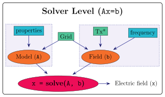
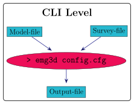

.. _usage:

Getting started
===============

.. todo::

   The basic example needs complete rework. Include all source and receiver
   types. Include saving and loading data.

Basic Example
-------------

Here we show a *very* basic example. To see some more realistic models have a
look at the `gallery <https://emsig.xyz/emg3d-gallery>`_. This particular
example is also there, with some further explanations and examples to show how
to plot the model and the data; see `«Minimum working example»
<https://emsig.xyz/emg3d-gallery/gallery/tutorials/minimum_example.html>`_. It
also contains an example without using ``discretize``.

First, we load ``emg3d`` and ``discretize`` (to create a mesh), along with
``numpy``:

.. ipython::

    In [1]: import emg3d
       ...: import numpy as np
       ...: from matplotlib.colors import LogNorm

First, we define the mesh (see :class:`discretize.TensorMesh` for more info).
In reality, this task requires some careful considerations. E.g., to avoid edge
effects, the mesh should be large enough in order for the fields to dissipate,
yet fine enough around source and receiver to accurately model them. This grid
is too small, but serves as a minimal example.

.. ipython::

    In [2]: grid = emg3d.TensorMesh(
       ...:         h=[[(25, 10, -1.04), (25, 28), (25, 10, 1.04)],
       ...:            [(50, 8, -1.03), (50, 16), (50, 8, 1.03)],
       ...:            [(30, 8, -1.05), (30, 16), (30, 8, 1.05)]],
       ...:         origin='CCC')
       ...: grid
    Out[2]:
       ...:   TensorMesh: 49,152 cells
       ...:
       ...:                       MESH EXTENT             CELL WIDTH      FACTOR
       ...:   dir    nC        min           max         min       max      max
       ...:   ---   ---  ---------------------------  ------------------  ------
       ...:    x     48       -662.16        662.16     25.00     37.01    1.04
       ...:    y     32       -857.96        857.96     50.00     63.34    1.03
       ...:    z     32       -540.80        540.80     30.00     44.32    1.05

Next we define a very simple fullspace model with
:math:`\rho_x=1.5\,\Omega\,\text{m}`, :math:`\rho_y=1.8\,\Omega\,\text{m}`, and
:math:`\rho_z=3.3\,\Omega\,\text{m}`. The source is an x-directed dipole at the
origin, with a 10 Hz signal of 1 A.

.. ipython::

    In [3]: model = emg3d.Model(grid, property_x=1.5, property_y=1.8,
       ...:                     property_z=3.3, mapping='Resistivity')
       ...: model
    Out[3]:    Model [resistivity]; triaxial; 48 x 32 x 32 (49,152)

    In [4]: sfield = emg3d.get_source_field(grid=grid, source=[0, 0, 0, 0, 0], frequency=10)

Now we can compute the electric field with ``emg3d``:

.. ipython::

    In [5]: efield = emg3d.solve(model=model, sfield=sfield, verb=4)
    Out[5]:
       ...: :: emg3d START :: 13:56:59 :: v0.17.1.dev18+gf20d741.d20210309
       ...:
       ...:    MG-cycle       : 'F'                 sslsolver : False
       ...:    semicoarsening : False [0]           tol       : 1e-06
       ...:    linerelaxation : False [0]           maxit     : 50
       ...:    nu_{i,1,c,2}   : 0, 2, 1, 2          verb      : 4
       ...:    Original grid  :  48 x  32 x  32     => 49,152 cells
       ...:    Coarsest grid  :   3 x   2 x   2     => 12 cells
       ...:    Coarsest level :   4 ;   4 ;   4   
       ...:
       ...:    [hh:mm:ss]  rel. error                  [abs. error, last/prev]   l s
       ...:
       ...:        h_
       ...:       2h_ \                  /
       ...:       4h_  \          /\    / 
       ...:       8h_   \    /\  /  \  /  
       ...:      16h_    \/\/  \/    \/   
       ...:
       ...:    [13:56:59]   2.623e-02  after   1 F-cycles   [1.464e-06, 0.026]   0 0
       ...:    [13:57:00]   2.253e-03  after   2 F-cycles   [1.258e-07, 0.086]   0 0
       ...:    [13:57:00]   3.051e-04  after   3 F-cycles   [1.704e-08, 0.135]   0 0
       ...:    [13:57:00]   5.500e-05  after   4 F-cycles   [3.071e-09, 0.180]   0 0
       ...:    [13:57:01]   1.170e-05  after   5 F-cycles   [6.531e-10, 0.213]   0 0
       ...:    [13:57:01]   2.745e-06  after   6 F-cycles   [1.532e-10, 0.235]   0 0
       ...:    [13:57:01]   6.873e-07  after   7 F-cycles   [3.837e-11, 0.250]   0 0
       ...:
       ...:    > CONVERGED
       ...:    > MG cycles        : 7
       ...:    > Final rel. error : 6.873e-07
       ...:
       ...: :: emg3d END   :: 13:57:01 :: runtime = 0:00:02

So the computation required seven multigrid F-cycles and took just a bit more
than 2 seconds. It was able to coarsen in each dimension four times, where the
input grid had 49,152 cells, and the coarsest grid had 12 cells.

.. ipython::

    @savefig basic_example.png width=4in
    In [6]: grid.plot_slice(efield.field, normal='Y', v_type='Ex', view='abs',
       ...:                 pcolor_opts={'norm': LogNorm()});

Usages
------

Simulations / High-level usage
~~~~~~~~~~~~~~~~~~~~~~~~~~~~~~

.. figure:: ../_static/levels1.svg
   :align: center
   :alt: High-level usage
   :name: high-level

   Workflow for the high-level usage: A **Simulation** needs a **Model** and a
   **Survey**. A survey contains all acquisition parameters such as sources,
   receivers, frequencies, and data, if available. A model contains the
   subsurface properties such as conductivities or resistivities, and the grid
   information.

Simulate responses for electric and magnetic receivers due to electric and
magnetic sources, in parallel. If data is provided it can also compute the
misfit and the gradient of the misfit function. It includes automatic, source
and frequency dependent gridding.

*Note:* In addition to ``emg3d`` this requires the soft dependency ``xarray``
(``tqdm`` and ``discretize`` are recommended).

Solver-level usage
~~~~~~~~~~~~~~~~~~~~~~~~~~~~~~

   Workflow for the solver-level usage: The **solve** function requires a
   **Model** ``A`` and a Source-**Field** ``b``. It then solves ``Ax=b`` and
   returns ``x``, the electric field, corresponding to the provided subsurface
   model and source field.

The solver level is the core of emg3d: It solves Maxwell's equations for the
provided subsurface model and the provided source field using the multigrid
method, returning the resulting electric field.

The function :func:`emg3d.solver.solve_source` simplifies the solver scheme. It
takes a model, a source, and a frequency, avoiding the need to generate the
source field manually, as shown in :numref:`Figure %s <solver-source-level>`.

.. figure:: ../_static/levels4.svg
   :align: center
   :alt: Solver-source level usage
   :name: solver-source-level

   Simplified solver-level workflow: The **solve_source** function requires a
   **Model**, a **Source**, and a **frequency**. It generates the source field
   internally, and returns ``x``, the electric field, corresponding to the
   provided input.

*Note:* This requires only ``emg3d`` (``discretize`` is recommended).

Command-line interface (CLI-level)
~~~~~~~~~~~~~~~~~~~~~~~~~~~~~~~~~~

   CLI-level usage: file-driven command-line usage of the high-level
   (Simulation) functionality of emg3d.

The command-line interface is a terminal utility for the high-level
(Simulation) usage of emg3d. The model and the survey have to be provided as
files (HDF5, npz, or json), various settings can be defined in the config file,
and the output will be written to the output file.

*Note:* In addition to ``emg3d`` this requires the soft dependency ``xarray``
(``tqdm`` and ``discretize`` are recommended), and ``h5py`` if the provided
files are in the HDF5 format.

Time-domain modelling
~~~~~~~~~~~~~~~~~~~~~

Time-domain modelling with emg3d is possible, but it is not implemented in the
high-level class ``Simulation``. It has to be carried out by using
:class:`emg3d.time.Fourier`, together with the Solver-level usage mentioned
above. Have a look at the repo https://github.com/emsig/article-TDEM.

*Note:* In addition to ``emg3d`` this requires the soft dependency ``empymod``
(``discretize`` is recommended).
